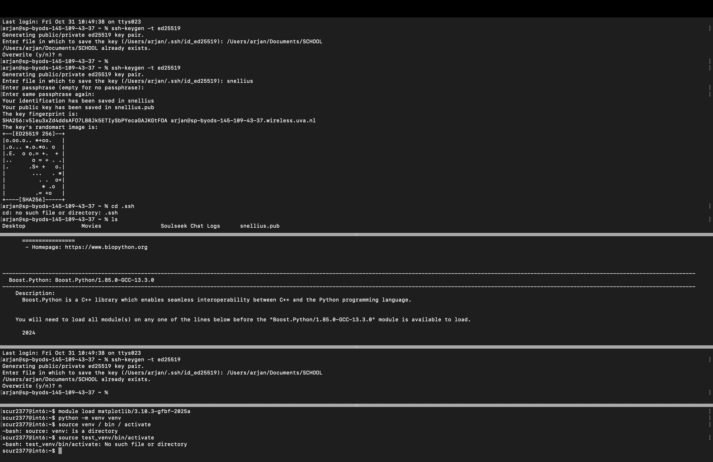

# MLOps  Assignment 1, Arjan van Staveren, 13607812

---

# step 1
-> The goal was to connect to snellius. The questions I had to answer were the following: 
	1. Create an account and an ssh to connect to snellius: ssh scur2377@snellius.surf.nl and i landend on node: int6 
	2. I provide the following screenshot of my login:  
	3. The process of creating and logging in with my ssh went without errors, thanks to te help of the present TA's. 
		My SSH client and version are: OpenSSH_9.3p2, LibreSSL 3.3.6  (found with the command ssh -V) 
		I did have previous experience with logging in using SSH, even though this was during a course I took 2 years ago.  
		Avoiding errors came down to me thoroughly questioning the TA's and linstening to them, step by step. 
# step 2
-> At this step, we had to create our own environment in which we could run python with some modules. I named mine test_venv. For me this was a confusing step, as I got lost in the different environments and layers.
	1.  

